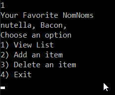

# 401-lab03
## Your Favorite NomNom list
   - This applications uses System.IO in C# to generate and work with a list of your favorite foods! Through the
   Menu the user is able: view the list, add items to the list, and delete items from the list. There is also
   a log of errors accessible through a hidden menu option. The menu will continually display until the user 
   chooses to exit

   - Visual/WalkThrough
   1. The application starts: 

   

   2. Option 1 displays the current list:

   

   3. Option 2 allows the user to input a favorite food to added to this list

   

   4. Option 3 allows the user to select a item to be deleted from the list

   

   5. Option 4 exits the program

   6. There is an undisplayed option to show the error log

   